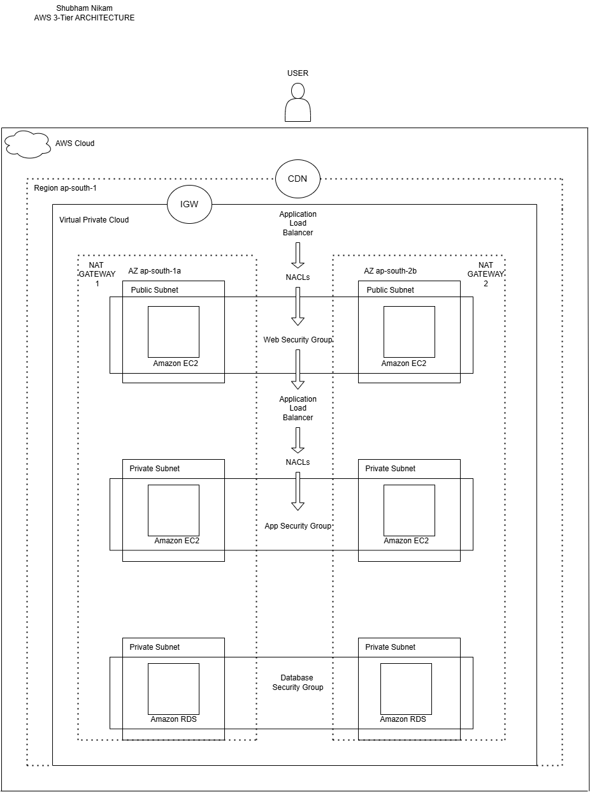

# AWS 3-Tier Architecture Deployment – Shubham Nikam

## 📦 Project Overview

This project demonstrates how to deploy a scalable 3-tier web application architecture using AWS services.

---

## 🧱 AWS Services Used

### 1. **VPC (Virtual Private Cloud)**
- A logically isolated network within AWS.
- Contains public and private subnets across multiple AZs (ap-south-1a and ap-south-1b).
- Controls traffic routing and segmentation across different layers (Web, App, Database).

### 2. **EC2 (Elastic Compute Cloud)**
- Hosts application code in:
  - Public Subnets → Web Servers
  - Private Subnets → App Servers
- Instances are launched in both AZs for high availability.

### 3. **Application Load Balancer (ALB)**
- Distributes HTTP/S traffic across EC2 instances.
- Web Tier ALB handles incoming traffic from users.
- App Tier ALB routes traffic to backend application EC2 instances in private subnets.

### 4. **CloudFront (CDN)**
- Speeds up content delivery using global edge locations.
- Caches static assets close to users, reducing latency.
- Sits in front of the ALB.

### 5. **CloudWatch**
- Monitors EC2 instances, ALB, and other AWS resources.
- Tracks logs, metrics, and sets alarms for abnormal activity.

### 6. **SNS (Simple Notification Service)**
- Sends alert notifications (via email/SMS) based on CloudWatch alarms.
- Useful for fault detection and response.

### 7. **RDS (Relational Database Service)**
- Managed database hosted in private subnets.
- Provides redundancy and automated backups.
- Connected only via the App Tier.

### 8. **Security Groups and NACLs**
- **Security Groups:** Act as firewalls for EC2 and RDS.
- **NACLs:** Provide subnet-level traffic control (stateless).
- Three tiers of Security Groups:
  - Web Security Group
  - App Security Group
  - Database Security Group

### 9. **NAT Gateway**
- Allows private subnet instances to access the internet (e.g., for updates) while remaining unreachable from the public.

### 10. **IGW (Internet Gateway)**
- Enables internet access for resources in public subnets.

---

## 🛠️ Deployment Overview

1. **User** makes a request via browser.
2. **CloudFront CDN** routes it to the **Web ALB**.
3. **Web Tier EC2** handles frontend logic.
4. Request passes to **App ALB**, routed to **App Tier EC2**.
5. App Tier communicates with **RDS** for data.
6. Monitoring & Alerts are handled by **CloudWatch + SNS**.

---

## 🔐 High Availability & Security

- Multi-AZ deployment.
- Tiered security (via Security Groups, NACLs).
- Least privilege access design.
- Private database layer, not accessible from the internet.

---

## 🧾 Credits
Diagram and implementation by **Shubham Nikam**
